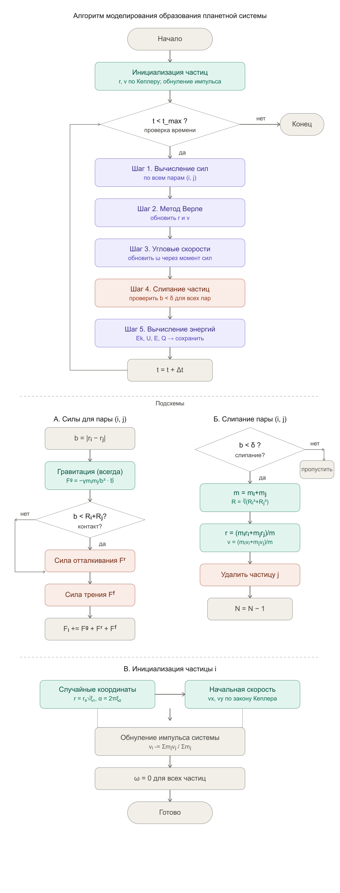

# Objective

The objective of this stage is to develop numerical modeling algorithms for the formation of a planetary system from a gas-dust cloud, including algorithms for calculating gravitational forces, repulsion and friction forces, integrating equations of motion, updating angular velocities, and particle coalescence, which will serve as the basis for implementing the simulation program.

# Tasks

1. Write a program simulating the motion of $N$ points in a plane, attracted to a fixed central point, non-interacting with each other, and moving in orbits with the first cosmic velocity.

2. Introduce gravitational interaction between particles. Remove the fixed central point. Add repulsion between particles when they approach within a distance less than the sum of their radii. Display kinetic and potential energy. Set the total momentum of the system to zero. Add friction forces between particles.

3. Include angular velocities of rotation around each particle's own axis in the model.

4. Simulate the 3D case of $N$ interacting particles with repulsion but without friction. Display projections of particle motion in the XY, YZ, and XZ planes. Plot kinetic, potential, and total energy as functions of time.

5. Introduce particle coalescence in the 3D case when particles approach within a small distance. When a larger particle forms, the total mass and momentum of the system must be conserved.

6. Introduce friction forces. Explain the behavior of kinetic and potential energy.

7. Introduce two types of particles with different masses and radii proportional to mass. Add friction forces between particles. Plot the energy dissipated as heat. Explain the total energy graph. Introduce particles with randomly assigned masses and corresponding radii.

# Algorithms for Solving the Problem

## Data Structures

Each particle is described by a set of parameters: mass $m_i$, radius $R_i$, coordinates $\mathbf{r}_i$, velocity $\mathbf{v}_i$, angular velocity $\omega_i$, and an activity flag (needed for handling coalescence). All particles are stored in a fixed-length array of size $N$.

## Initialization

Before the main loop begins, a one-time initialization of the system is performed.

The radius and angle of each particle are chosen randomly to ensure a uniform distribution over the disk area:

$$r = r_0\sqrt{\xi_1}, \quad \alpha = 2\pi\,\xi_2$$

from which the coordinates are: $x = r\cos\alpha$, $y = r\sin\alpha$, $z = 0$.

Initial velocities are set based on Keplerian rotation:

$$v_x = -y\,\omega_0\left(\frac{r_0}{r}\right)^{3/2}, \quad v_y = x\,\omega_0\left(\frac{r_0}{r}\right)^{3/2}, \quad v_z = 0$$

After this, the center of mass velocity is subtracted from all particles so that the total momentum of the system becomes zero:

$$\mathbf{v}_i \leftarrow \mathbf{v}_i - \frac{\sum_j m_j \mathbf{v}_j}{\sum_j m_j}$$

The rotational angular velocities $\omega_i$ are initially set to zero.

## Main Loop

At each time step $\Delta t$, the following blocks are executed sequentially.

### Step 1. Force Calculation

All pairs of active particles $(i, j)$, $i < j$ are iterated over. For each pair, the vector $\mathbf{b}_{ij} = \mathbf{r}_i - \mathbf{r}_j$ and distance $b = |\mathbf{b}_{ij}|$ are computed.

**Gravitational force** is always computed:

$$\mathbf{F}^g_{ij} = -\frac{\gamma m_i m_j}{b^3}\,\mathbf{b}_{ij}$$

**Repulsion and friction forces** are computed only if $b < R_i + R_j$. The repulsion force is:

$$\mathbf{F}^r_{ij} = k\left(\left(\frac{R_i+R_j}{b}\right)^8 - 1\right)\frac{\mathbf{b}_{ij}}{b}$$

For the friction force, we first find the perpendicular component of the relative velocity — the part of $\mathbf{W} = \mathbf{v}_i - \mathbf{v}_j$ that is directed across $\mathbf{b}_{ij}$, accounting for particle rotation:

$$W_\perp = (\mathbf{W} \cdot \mathbf{n}_{ij}) - \omega_i R_i - \omega_j R_j$$

where $\mathbf{n}_{ij}$ is the unit vector perpendicular to $\mathbf{b}_{ij}$. Then the friction force is:

$$\mathbf{F}^f_{ij} = \beta\,W_\perp\,F^r(b)\,\mathbf{n}_{ij}$$

By Newton's third law, the forces on particle $j$ are opposite in sign. The total force on each particle is accumulated in the array $\mathbf{F}_i$.

### Step 2. Integration of Equations of Motion

Coordinates and velocities are updated using the velocity Verlet method, which provides second-order accuracy and good energy conservation:

$$\mathbf{r}_i \leftarrow \mathbf{r}_i + \mathbf{v}_i\,\Delta t + \frac{\mathbf{F}_i}{2m_i}\,\Delta t^2$$

$$\mathbf{v}_i \leftarrow \mathbf{v}_i + \frac{\mathbf{F}_i^{\,\text{old}} + \mathbf{F}_i^{\,\text{new}}}{2m_i}\,\Delta t$$

This requires storing forces from the previous time step.

### Step 3. Updating Angular Velocities

For each particle, the torques from friction forces of all neighboring particles in contact ($b_{ij} < R_i + R_j$) are summed:

$$\varepsilon_i = \frac{1}{I_i}\sum_{j} \frac{b_{ij}}{R_i + R_j} F^f_{ij}, \quad I_i = \frac{2}{5}m_i R_i^2$$

The angular velocity is updated using the Euler method:

$$\omega_i \leftarrow \omega_i + \varepsilon_i\,\Delta t$$

### Step 4. Coalescence Condition Check

All active pairs $(i, j)$ are iterated over. If $b_{ij} < \delta$ (a threshold distance), the particles merge: the parameters of the new particle are computed conserving mass and momentum:

$$m \leftarrow m_i + m_j, \quad R \leftarrow \sqrt[3]{R_i^3 + R_j^3}$$

$$\mathbf{r} \leftarrow \frac{m_i\mathbf{r}_i + m_j\mathbf{r}_j}{m}, \quad \mathbf{v} \leftarrow \frac{m_i\mathbf{v}_i + m_j\mathbf{v}_j}{m}$$

The result is written to particle $i$, and particle $j$ is marked as inactive. The total number of active particles decreases by one.

### Step 5. Energy Calculation and Recording

$$E_k = \sum_i \frac{m_i v_i^2}{2} + \sum_i \frac{I_i \omega_i^2}{2}, \quad U = -\frac{1}{2}\sum_{i \neq j} \frac{\gamma m_i m_j}{b_{ij}}$$

$$E = E_k + U, \quad Q(t) = E(0) - E(t)$$

The values are saved for subsequent plotting.

# Flowcharts

Let's construct a flowchart for clarity ([Fig. 1](#fig-001)).

{#fig-001 width=70%}

**Main loop** — the upper part. Shows the sequence of steps at each time iteration: force calculation → Verlet method → angular velocities → coalescence → energies → $t \mathrel{+}= \Delta t$, and return to the condition check.

**Sub-chart A** — details the force calculation step for each pair $(i, j)$: gravity is always computed first, then contact is checked, and repulsion and friction are added only if $b < R_i + R_j$.

**Sub-chart B** — the coalescence algorithm: threshold check $\delta$, computation of new $m$, $R$, $\mathbf{r}$, $\mathbf{v}$, removal of one particle.

**Sub-chart C** — initialization: random coordinates according to Kepler, zeroing of total momentum, zeroing of angular velocities.

# Conclusion

At this stage, numerical modeling algorithms have been developed: initialization of the particle system, calculation of gravitational forces, repulsion and friction forces, integration of equations of motion using the Verlet method, updating angular velocities, particle coalescence conserving mass and momentum, as well as calculation of the system's energies. These algorithms serve as the basis for program implementation in the next stage.

# References

1. Medvedev D. A. — Modeling of Physical Processes and Phenomena on a PC (in Russian)
2. Implementation of the basic Störmer-Verlet method (in Russian)
3. Gravitational N-body problem (in Russian)
4. N-body simulations (in Russian)
5. General introduction to the Discrete Element Method (in Russian)

::: {#refs}
:::