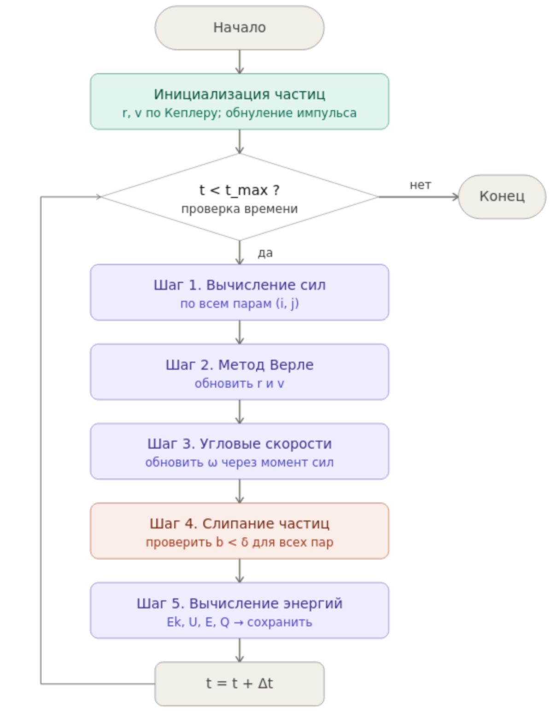
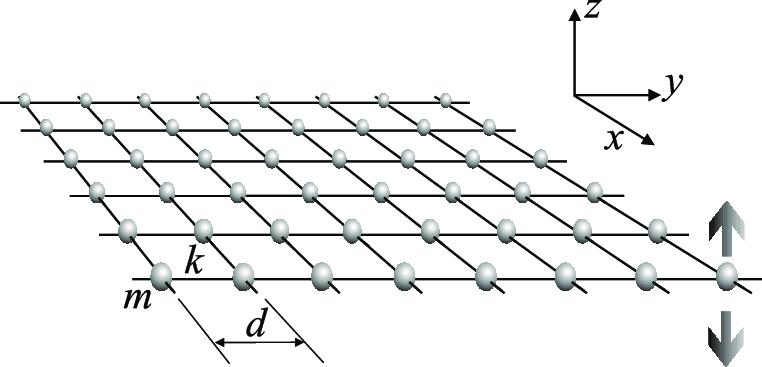
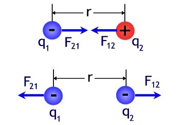

## Authors

| Name | Degree | Email |
|------|--------|-------|
| Arbatova Varvara Petrovna | BSc | 1132236020@rudn.ru |
| Karpova Eseniya Alekseevna | BSc | 1132236008@rudn.ru |
| Dagdelen Zeinap Redzhepovna | BSc | 1132236052@rudn.ru |
| Byugdanyuk Anna Vasilievna | BSc | 1132236023@rudn.ru |
| Lyupp Sofya Romanovna | BSc | 1132236039@rudn.ru |

**Peoples' Friendship University of Russia (RUDN University)**

Moscow, Ordzhonikidze St., 3

---

# Objective

Develop **numerical modeling algorithms** for the formation of a planetary system from a gas-dust cloud for subsequent program implementation.

---

# Flowchart (Main Loop)

Let's examine each step in detail

---

# Data Structures

- Each particle is described by a set of parameters
- All particles are stored in an array of length $N$
- **Active** particles participate in calculations
- **Inactive** particles are ignored (after coalescence)

---

# Initialization

Particles are distributed in a disk:

$$r = r_0\sqrt{\xi_1}, \quad \alpha = 2\pi\,\xi_2$$

Initial velocities — Keplerian:

$$v_x = -y\,\omega_0\left(\frac{r_0}{r}\right)^{3/2}$$

$$v_y = x\,\omega_0\left(\frac{r_0}{r}\right)^{3/2}$$

$$v_z = 0$$

Center of mass reset (total momentum correction)

---

# Step 1. Force Calculation. Gravity and Repulsion

**Gravity:**

$$\mathbf{F}^g_{ij} = -\frac{\gamma m_i m_j}{b^3}\,\mathbf{b}_{ij}$$

- **Gravity** — attraction between particles
- **Repulsion** — upon collision/compression (increases as distance decreases)

Resultant force: vector sum over all particle pairs

---

# Step 1. Force Calculation. Friction Force (Tangential)

- Depends on the relative velocity of surfaces
- Accounts for particle rotation ($\omega_i R_i$ — surface velocity)
- Directed tangentially to the contact

---

# Step 2. Integration of Equations of Motion (Verlet Method)

**Predictor (position):**

$$\mathbf{r}_i \leftarrow \mathbf{r}_i + \mathbf{v}_i\,\Delta t + \frac{\mathbf{F}_i}{2m_i}\,\Delta t^2$$

**Corrector (velocity):**

$$\mathbf{v}_i \leftarrow \mathbf{v}_i + \frac{\mathbf{F}_i^{\,\text{old}} + \mathbf{F}_i^{\,\text{new}}}{2m_i}\,\Delta t$$

---

# Step 3. Updating Angular Velocities

**Moment of inertia of a sphere:**

$$I_i = \frac{2}{5}m_i R_i^2$$

**Angular acceleration from tangential friction forces:**

$$\varepsilon_i = \frac{1}{I_i}\sum_{j} \frac{b_{ij}}{R_i + R_j} F^f_{ij}$$

**Update:**

$$\omega_i \leftarrow \omega_i + \varepsilon_i\,\Delta t$$

---

# Step 4. Coalescence Condition Check

**Condition:** distance $b_{ij} < \delta$ (threshold)

**Conservation:**

- **Mass:** $m = m_i + m_j$
- **Momentum:** $\mathbf{v} = (m_i\mathbf{v}_i + m_j\mathbf{v}_j)/m$
- **Radius:** $R = \sqrt[3]{R_i^3 + R_j^3}$

Result placed at position $i$, particle $j$ becomes inactive

---

# Step 5. Energy Calculation and Recording

**Kinetic Energy:**

$$E_k = \sum_i \frac{m_i v_i^2}{2} + \sum_i \frac{I_i \omega_i^2}{2}$$

**Potential Energy:**

$$U = -\frac{1}{2}\sum_{i \neq j} \frac{\gamma m_i m_j}{b_{ij}}$$

**Total Energy and Dissipation:**

$$E = E_k + U, \quad Q(t) = E(0) - E(t)$$

---

# Conclusion

At this stage, the following modeling algorithms have been developed:

- Particle initialization
- Force calculation (gravity, repulsion, friction)
- Verlet integration
- Angular velocity updates
- Particle coalescence
- Energy calculation

**These algorithms form the basis for program implementation**